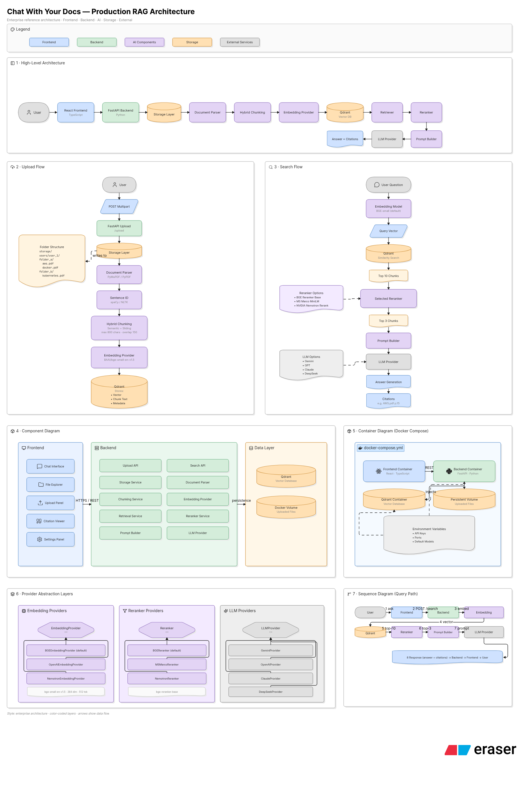

# Manager of Documents (ManDoc)

A production-ready Retrieval-Augmented Generation (RAG) platform to securely index, search, and chat with your documents using advanced AI models. 

## 🏗 Architecture



ManDoc is built using a modern, scalable, and fully dockerized microservices architecture:

- **Frontend:** A responsive, dark-mode first UI built with React, Vite, Tailwind CSS, and Redux for state management.
- **Backend:** A high-performance Python backend powered by FastAPI.
- **Vector Database:** Qdrant is used for fast and efficient vector similarity search.
- **Embedding & Reranking:** Leverages local HuggingFace BAAI models (`bge-small-en` and `bge-reranker-base`) to accurately retrieve relevant document chunks before feeding them to the LLM.
- **Language Model:** Integrates seamlessly with external APIs (like NVIDIA NIM or OpenAI) via the OpenAI SDK to generate crisp, context-aware answers.

## 📋 Prerequisites

- **OS:** Ubuntu (or a Debian-based Linux distribution)
- **Engine:** Docker and Docker Compose installed

## 🚀 Getting Started

1. **Configure Environment Variables:**
   Create a `.env` file in the root directory. You will need to supply:
   - `NVIDIA_API_KEY` (or your chosen OpenAI-compatible API key)
   - `HF_TOKEN` (HuggingFace token for downloading the local embedder/reranker models)
   - `APP_KEY` (Input any random, secure string to act as your application's master token)

2. **Start the Application:**
   Run the automated setup script to build and start the docker containers:
   ```bash
   ./setup.sh
   ```

3. **Access the UI:**
   Once the containers are running, access the web interface securely via your browser:
   ```
   http://localhost:3000/?ticketchecker={YOUR_APP_KEY}
   ```
   *(Replace `{YOUR_APP_KEY}` with the exact string you set in your `.env` file)*

## 🛠 Maintenance & Development

- If you make changes to the underlying code, libraries, or `.env` variables and they do not immediately reflect, simply run the restart script:
  ```bash
  ./restart.sh
  ```

## 🔮 Future Improvements

The platform is designed to scale. Future roadmap items include:
- **Multi-Tenant Architecture:** Seamless handling and data isolation for multiple concurrent users.
- **Dynamic LLM Routing:** Support for hot-swapping between multiple external LLMs (OpenAI, Anthropic, Gemini, etc.) on the fly.
- **Pluggable Pipelines:** Ability to select and support multiple varied Embedders and Re-rankers tailored to specific enterprise use cases.

## 💡 Developer Notes

This project marks my first time building with **Python** and **Tailwind CSS**:
- **Python** was chosen as the backend language because of its unparalleled ecosystem and appropriateness for AI, ML, and RAG applications. 
- **Tailwind CSS** is the new industry trend for styling, so I decided to give it a try to build a modern, sleek, and highly responsive user interface!

## 🤖 AI Assisted Development

This project heavily leveraged cutting-edge AI tools throughout its entire lifecycle:
- **Prompt Generation (Architecture, Coding & UI):** ChatGPT 5.5
- **UX Generation & Ideation:** Gemini + Canva
- **Architecture Diagrams:** Eraser.io
- **Autonomous Coding & Engineering:** Antigravity + Gemini 3.1 Pro